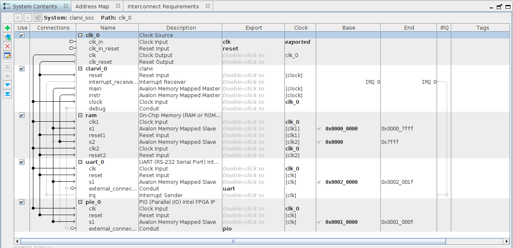
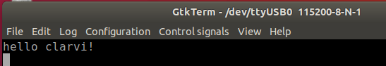

# MAX1000

## 構成

[clarvi_fpga.zip](https://www.cl.cam.ac.uk/teaching/1617/ECAD+Arch/files/distribution/clarvi_fpga.zip)の内容と[講義資料](https://www.cl.cam.ac.uk/teaching/1617/ECAD+Arch/clarvi-fpga.html)をもとにMAX1000に合わせて構成。UARTとPIOを追加。RAMはDual Portで32KB。

### リソース使用量

| 項目                 | 使用量                  |
|:---------------------|:------------------------|
| Total logic elements | 4,604 / 8,064 (57%)     |
| Total registers      | 2030                    |
| Total memory bits    | 262,144 / 387,072 (68%) |

## メモリマップ

| アドレス                  | 用途                  |
|:--------------------------|:----------------------|
| 0x0000_0000 - 0x0000_7FFF | On-Chip Memory (32KB) |
| 0x0001_0000 - 0x0001-000F | LED                   |
| 0x0002_0000 - 0x0002_001F | UART                  |

## UARTのレジスタ

| オフセット | レジスタ              |
|:-----|:----------------------------|
| 0x00 | Receive Data                |
| 0x04 | Transmit Data               |
| 0x08 | Status Register             |
| 0x0C | Control Register            |
| 0x10 | Baund Rate Divisor Register |

## hello アプリケーション

